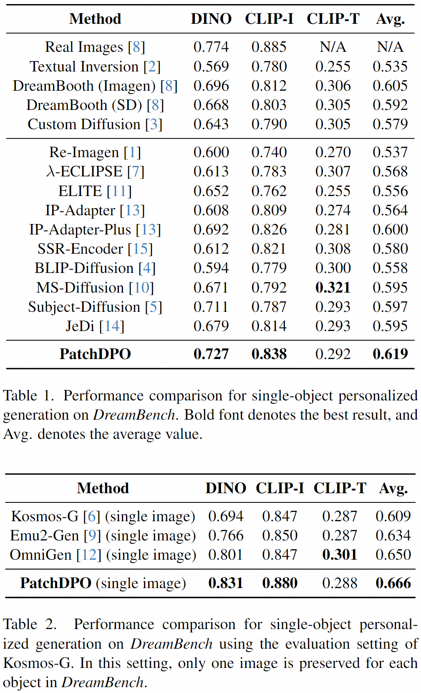

## <div align="center"> PatchDPO: Patch-level DPO for Finetuning-free Personalized Image Generation </div>

<div align="center">

  <a href="https://arxiv.org/abs/2412.03177"></a> &ensp;
  <a href="https://huggingface.co/hqhQAQ/PatchDPO/tree/main"></a> &ensp;

</div>

### Overview

This is the official implementation of paper "PatchDPO: Patch-level DPO for Finetuning-free Personalized Image Generation" [[arXiv](https://arxiv.org/abs/2412.03177)], which achieves **state-of-the-art** performance on personalized image generation, with **only 4 hours** of training time on 8 GPUs, as shown in Table 1 & 2.

⭐⭐~If you find the resources of this project (e.g., dataset, model weights, training code) helpful, please kindly leave a star here😊.

### Introduction

This work proposes an additional training stage for personalized generation models using DPO (*i.e.*, direct preference optimization), achieving a significant performance improvement.
Traditional DPO only determines the overall superiority or inferiority of two samples, which is not suitable for personalized image generation because the generated images are commonly inconsistent with the reference images only in some local image patches.
To tackle this problem, this work proposes PatchDPO that estimates the quality of image patches within each generated image and accordingly trains the model.
The framework of our method is shown as below.
With PatchDPO, our model achieves **state-of-the-art** performance on personalized image generation, with **only 4 hours** of training time on 8 GPUs, as shown in Table 1 & 2.


### 🔥🔥🔥 News!!

- 📰 Our paper is available at [arXiv](https://arxiv.org/abs/2412.03177).
- 🤗 Our model weights are available at [Hugging Face](https://huggingface.co/hqhQAQ/PatchDPO/tree/main).
- 🚀 Training code is available here.
- 🚀 Inference code is available here.
- 🚀 Evaluation code is available here.
- 💬 Our preliminary work **MIP-Adapter** for multi-object personalized generation is available at [MIP-Adapter](https://github.com/hqhQAQ/MIP-Adapter).
- 💬 Our preliminary work **MS-Diffusion** for multi-object personalized generation is available at [MS-Diffusion](https://github.com/MS-Diffusion/MS-Diffusion).

### Performance

#### Quantitative Comparison

We compare PatchDPO with other personalized image generation methods on the famous *DreamBench*.
Three metrics are used for evaluation on this benchmark: DINO, CLIP-I, and CLIP-T.
Note that CLIP-T evaluates the text alignment, and DINO, CLIP-I evaluate the image alignment.

The comparison results are demonstrated in Table 1 & 2 (the results of other methods are from their paper):

<div style="display: flex; justify-content: center;">
   
</div>

Detailedly, two evaluation settings are adopted in Table 1 & 2, respectively.

* **Table 1** uses the original setting following most existing methods. In this setting, DINO, CLIP-I are calculated by comparing the generated image and **all images of the same object**.

* **Table 2** uses the evaluation setting following [Kosmos-G](https://github.com/xichenpan/Kosmos-G). In this setting, only one image is preserved for each object, and DINO, CLIP-I are calculated by comparing the generated image and **only this image**.

#### Qualitative Comparison

Examples of generated images from PatchDPO are demonstrated below:


### Requirements

The Python packages required for this project are listed below:

```
torch==1.13.1
torchvision==0.14.1
diffusers==0.23.1
einops
modelscope
numpy==1.24.4
oss2
Pillow==10.1.0
PyYAML
safetensors
tqdm
imgviz
transformers==4.35.2
tensorboard
accelerate==0.23.0
opencv-python
openai-clip
setuptools==69.5.1
```

### Dataset

* **Training dataset.** The release of training dataset is in preparation.

* **Test dataset.** We evaluate our model on the famous **DreamBench**.

    Prepare this dataset by downloading the `dataset` folder ([DreamBooth dataset](https://github.com/google/dreambooth/tree/main/dataset)), and placing it in the `dreambench` folder of this project.
    Finally, the file structure of the `dreambench` folder is as below:

    ```
    --dreambench
        |--dataset
            |--backpack
            |--backpack_dog
            |--bear_plushie
            |--berry_bowl
            |...
        |--json_data
    ```

### Pre-trained models

* **Base model.** PatchDPO is based on the SDXL model, which is required for both training and inference. Prepare this model by downloading the pre-trained weights from Hugging Face:

    * [SG161222/RealVisXL_V1.0](https://huggingface.co/SG161222/RealVisXL_V1.0)

* **Training.** PatchDPO is trained based on the IP-Adapter-Plus model. Prepare this model by downloading the pre-trained weights from Hugging Face:

    * [h94/IP-Adapter](https://huggingface.co/h94/IP-Adapter)

* **Inference and evaluation.** Our trained PatchDPO model can be downloaded from:

    * [hqhQAQ/PatchDPO](https://huggingface.co/hqhQAQ/PatchDPO)

The path of these models will be `/PATH/TO/RealVisXL_V1.0/`, `/PATH/TO/IP-Adapter/`, and `/PATH/TO/PatchDPO/` respectively.

### Training

Run the following script for training the PatchDPO model based on the IP-Adapter-Plus model using the patchdpo dataset. (note that `/PATH/TO` in `--pretrained_model_name_or_path`, `--image_encoder_path`, `--pretrained_ip_adapter_path`, `--data_root_path`, and `patch_quality_file` should be changed to your own path, and 8 GPUs are used here).

```
accelerate launch --num_processes 8 --multi_gpu --mixed_precision "fp16" train_patchdpo.py \
    --pretrained_model_name_or_path /PATH/TO/RealVisXL_V1.0/ \
    --image_encoder_path /PATH/TO/IP-Adapter/models/image_encoder/ \
    --pretrained_ip_adapter_path /PATH/TO/IP-Adapter/sdxl_models/ip-adapter-plus_sdxl_vit-h.bin \
    --data_root_path /PATH/TO/patchdpo_dataset/ \
    --patch_quality_file /PATH/TO/patchdpo_dataset/patch_quality.pkl \
    --mixed_precision fp16 \
    --resolution 512 \
    --train_batch_size 4 \
    --dataloader_num_workers 4 \
    --learning_rate 3e-05 \
    --weight_decay 0.01 \
    --save_steps 10000 \
    --stop_step 30000 \
    --output_dir output/exp1/ \
    --use_dpo_loss True
```

### Inference

Run the following scripts to conduct inference on *DreamBench*.
Note that `/PATH/TO/model.bin` is the path of the trained model to be evaluated.

* Inference using the **original setting** using 2 GPUs:

    ```
    accelerate launch --num_processes 2 --multi_gpu --mixed_precision "fp16" inference_dreambooth.py \
        --base_model_path /PATH/TO/RealVisXL_V1.0/ \
        --image_encoder_path /PATH/TO/IP-Adapter/models/image_encoder/ \
        --ip_ckpt /PATH/TO/PatchDPO/model.bin \
        --data_root dreambench \
        --output_dir output/exp1_eval/ \
        --scale 0.78 \
        --is_kosmosg False
    ```

* Inference using the **Kosmos-G setting** using 2 GPUs:

    ```
    accelerate launch --num_processes 2 --multi_gpu --mixed_precision "fp16" inference_dreambooth.py \
        --base_model_path /PATH/TO/RealVisXL_V1.0/ \
        --image_encoder_path /PATH/TO/IP-Adapter/models/image_encoder/ \
        --ip_ckpt /PATH/TO/PatchDPO/model.bin \
        --data_root dreambench \
        --output_dir output/exp1_eval_kosmosg/ \
        --scale 0.65 \
        --is_kosmosg True
    ```

### Evaluation

We concisely merge the original evaluation setting and the Kosmos-G setting into a single script (`evaluate_dreambooth.py`) for DreamBench evaluation, making it convenient for future researchers to use.

Two steps for running this script:

* First, generate the images into a folder `$output_dir` in the way you like, **as long as** it is in the following format:

    ```
    --$output_dir
        |--backpack
            |--a backpack floating in an ocean of milk.png
            |--a backpack floating on top of water.png
            |--a backpack in the jungle.png
            |...
        |--backpack_dog
        |--bear_plushie
        |--berry_bowl
        |...
    ```

    Detailedly, `$output_dir` contains 30 subfolders (corresponding to 30 objects), and each subfolder saves the generated images for each object, which is also named with this object (*i.e.*, the folder names are consistent with those in [dreambench/dataset](https://github.com/google/dreambooth/tree/main/dataset)).

    Each subfolder contains 25 images (corresponding to 25 prompts for each object), and each image is named with the corresponding prompt.

* Next, run the following scripts for evaluation in two settings:

    * **Original setting:**

    ```
    python evaluate_dreambooth.py \
        --output_dir $output_dir \
        --data_root dreambench \
        --is_kosmosg False
    ```

    * **Kosmos-G setting:**

    ```
    python evaluate_dreambooth.py \
        --output_dir $output_dir \
        --data_root dreambench \
        --is_kosmosg True
    ```